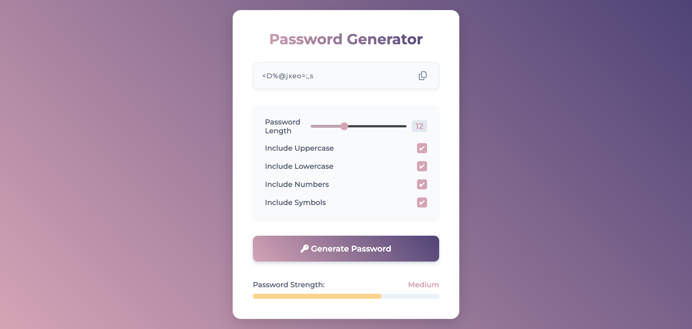

# Password Generator

A simple client-side password generator with a live strength meter, built with plain HTML, CSS and JavaScript.



**[Live Demo](https://pirotskyi.github.io/password-generator/)**

## Features

- Adjustable password length via range slider (6–24 characters)
- Toggle character sets: uppercase, lowercase, numbers, symbols
- Real-time password strength meter
- One-click copy to clipboard with visual confirmation
- Auto-generates a password on page load

## Tech Stack

`HTML5` `CSS3` `JavaScript` · [Font Awesome](https://fontawesome.com/) (icons)

## Project Structure

```
├── index.html
├── style.css
└── script.js
```

## Getting Started

```bash
git clone <repository URL>
cd password-generator
```

Open `index.html` in a browser — no dependencies or build step required.
